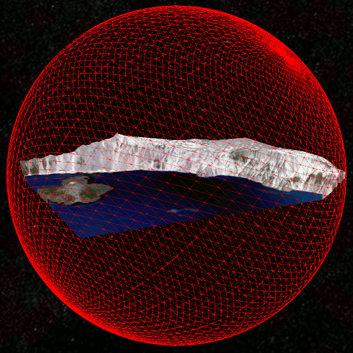
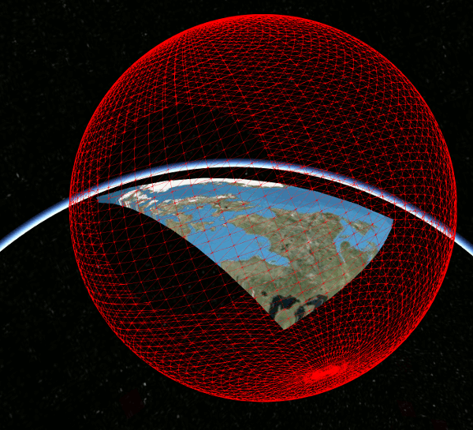
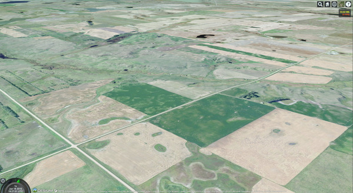
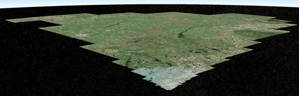
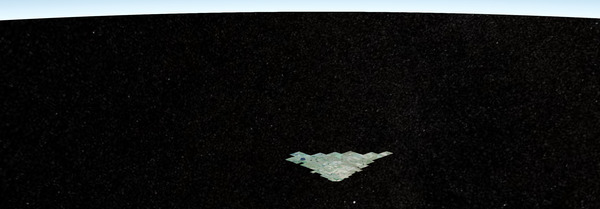

Oriented Bounding Boxes for Terrain and 3D Buildings
====================================================

This is a technical article on rendering work that I (Kai Ninomiya) have been
working on as part of my internship at AGI.

In Cesium 1.11, we will be releasing an improvement to the network and
rendering performance of tiled data and other geometry.
Cesium currently uses bounding spheres for view frustum culling, to
avoid processing and rendering data that does not appear on the screen.
In this change, we add support for culling terrain and 3D buildings using
arbitrarily-oriented bounding boxes.

For a quick comparison, this GIF shows both types of bounding volumes for a
tile at Crater Lake in Oregon:

It even works fairly well for much larger tiles, such as this one between Quebec
and the north pole, which improves upon the bounding sphere:

In practice, for terrain tiles on the Cesium globe, we see anywhere between a 0%
and 50% (usually 5-20%) reduction in number of tiles rendered, depending on the
camera view.
The bounding box optimization turns out to provide the greatest benefits (around
50% reduction) when the camera is looking down at an angle below the horizon.
Without the new bounding box method, the bounding spheres of tiles above the
camera's view have a high chance of intersecting with the camera frustum even
though the tiles themselves are not visible.
This can be seen in this comparison:

Camera view:

Tiles rendered using bounding spheres (599 tiles):

Tiles rendered using oriented bounding boxes (307 tiles):

For terrain data, our current method for computing oriented bounding boxes is
conceptually simple: create the bounding box in the local surface reference
frame at the center of a tile, then compute the extents necessary to completely
enclose the entire tile.
