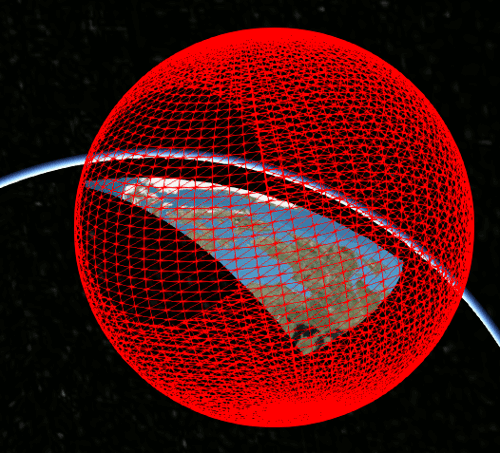

Oriented Bounding Boxes for Terrain and 3D Buildings
====================================================

This is a technical article on rendering work that I (Kai Ninomiya) have been
working on as part of my internship at AGI.

Overview
--------

In Cesium 1.11 (?), we will be releasing an improvement to the network and
rendering performance of tiled data and other geometry.  Cesium currently uses
bounding spheres for view frustum culling, to avoid processing and rendering
data that does not appear on the screen.  In this change, we add support for
culling terrain and 3D buildings using arbitrarily-oriented bounding boxes.

For a quick comparison, this GIF shows both types of bounding volumes for a
tile at Crater Lake in Oregon:

It even works fairly well for much larger tiles, such as this one between Quebec
and the north pole, which improves upon the bounding sphere:

Results
-------

In practice, for terrain tiles on the Cesium globe, we see anywhere between a 0%
and 50% (typically around 10%) reduction in number of tiles rendered, depending
on the camera view.

| Tiles rendered at 1920x1080 | [Directly downward](http://cesiumjs.org/Cesium/Build/Apps/CesiumViewer/index.html?view=120.34723663330078%2C15.138801611751108%2C10590.602601097456%2C360%2C-89.90326148519773%2C0) | [Toward horizon, high altitude](http://cesiumjs.org/Cesium/Build/Apps/CesiumViewer/index.html?view=119.7954832286864%2C14.625866129373039%2C32421.396898129005%2C46.017725109639954%2C-21.092747155669294%2C0.07233855930825417) | [Toward horizon, low altitude](http://cesiumjs.org/Cesium/Build/Apps/CesiumViewer/index.html?view=120.28867831296651%2C15.087807528789323%2C4406.192801986939%2C46.14351181495515%2C-20.429229458524063%2C0.0742423709965139) | [Below horizon](http://cesiumjs.org/Cesium/Build/Apps/CesiumViewer/index.html?view=-99.86107569851391%2C47.97316693251584%2C1160.1513943660475%2C314.5829070968285%2C-20.986424760513852%2C359.8538194959233) |
| -------------------:| --:| ----:| ---:| ---:|
| OrientedBoundingBox | 66 |  218 | 279 | 307 |
|      BoundingSphere | 66 |  226 | 330 | 599 |
|       *improvement* | 0% | 3.5% | 10% | 48% |

The bounding box optimization turns out to provide the greatest benefits (around
50% reduction) when the camera is looking down at an angle below the horizon.
Without the new bounding box method, the bounding spheres of tiles which are
above the camera's view have a high chance of intersecting with the camera
frustum even though the tiles themselves are not visible.  This can be seen in
this comparison:

Camera view:

Tiles rendered using bounding spheres (599 tiles):

Tiles rendered using oriented bounding boxes (307 tiles):

Bounding Box Computation and Testing
------------------------------------

For terrain data, our current method for computing oriented bounding boxes is
conceptually simple: create the bounding box in the local surface reference
frame at the center of a tile, then compute the extents necessary to completely
enclose the entire tile. This is done once for each object (tile).

To check whether a bounding box is outside the viewing frustum, we use a simple
method from Eric Lengyel's *Mathematics for 3D Game Programming*.  In this
method, each plane of the frustum is checked for intersection with the oriented
bounding box.  This is basically the same as the method previously used for
bounding spheres.

Though this method is almost as simple, computing intersections with a bounding
box is more expensive than with a bounding sphere.  As such, there is some CPU
overhead gained in the trade-off between CPU and GPU/network.  However, this
provides a significant improvement in network performance in many cases.

| Volume used for terrain tiles | Rendering time spent in `intersectPlane` |
| -----------------------------:|:---------------------------------------- |
|           OrientedBoundingBox | 2.1%                                     |
|                BoundingSphere | 1.6%                                     |
